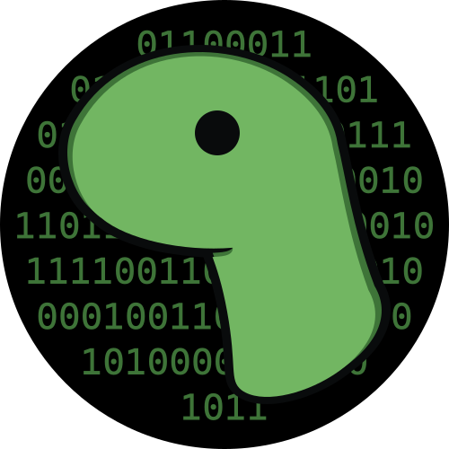

 
  
 <h1 align="center">neo</h1>

  
  
  

`neo` is the module for working with matrices, ndarrays, tensors and linear
algebra in deno. Accelerated using WebGPU and WASM it runs anywhere a browser
runs.

## Maintainers

- Elias Sjögreen ([@eliassjogreen](https://github.com/eliassjogreen))

## Other

### Contribution

Pull request, issues and feedback are very welcome. Code style is formatted with
`deno fmt` and commit messages are done following Conventional Commits spec.

### Licence

Copyright 2021, the denosaurs team. All rights reserved. MIT license.
